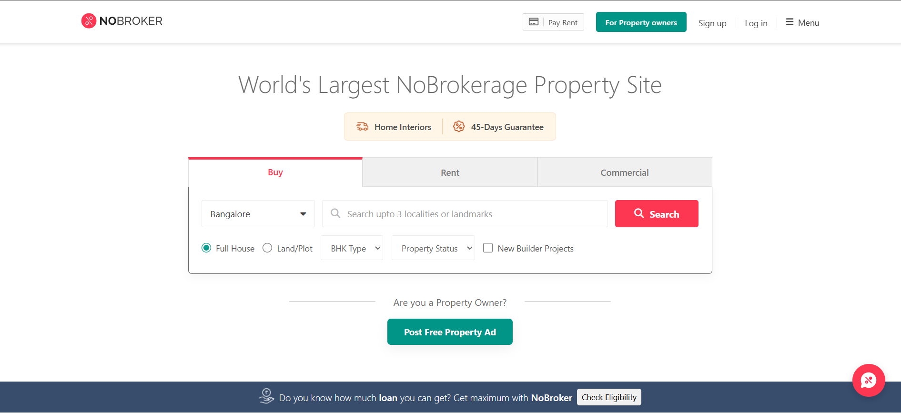
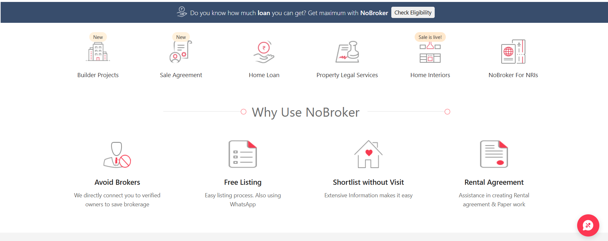
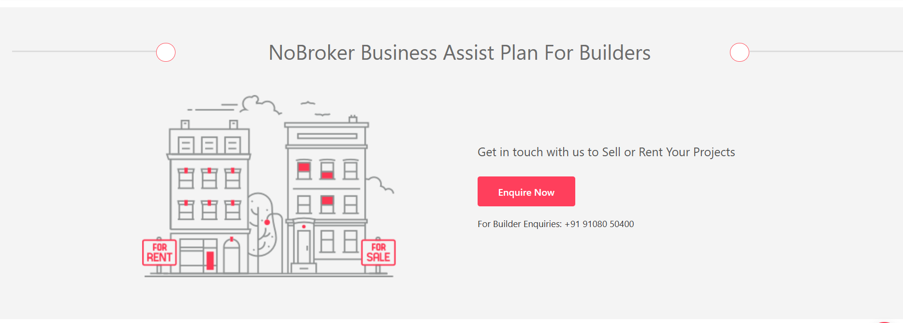
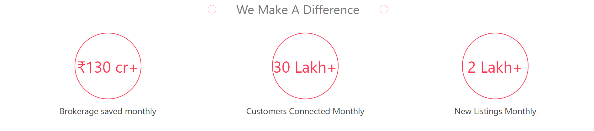
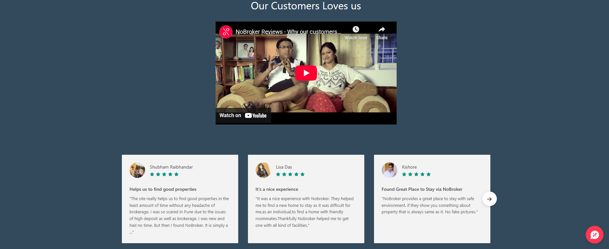
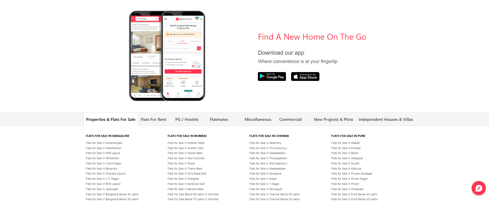
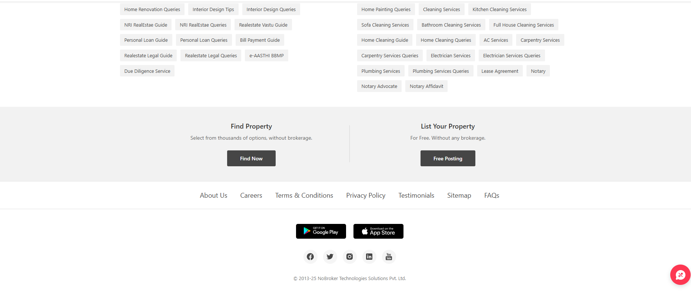

## 📺 Preview

### Desktop Version









# NoBroker.in Clone

A pixel-perfect, responsive clone of the [NoBroker.in](https://www.nobroker.in/) homepage, built using pure **HTML5** and **CSS3**. This project replicates the layout, styling, and responsiveness of the original real estate platform without using any external frameworks like Bootstrap or Tailwind.

## 🚀 Live Demo

*https://github.com/skrm05/no-broker-landing-page.git*

## 🛠️ Technologies Used

- **HTML5**: Semantic structure.
- **CSS3**: Flexbox, CSS Grid, Hover effects, and responsive design.
- **Font Awesome**: For scalable vector icons (Search, User, Menu, etc.).
- **Google Fonts**: Used 'Open Sans' to match the original typography.

## ✨ Features

This clone includes the following sections, designed to match the original site 100%:

1.  **Sticky Navbar**:
    - Fixed positioning with a subtle shadow.
    - "Pay Rent" button with icon separation.
    - "For Property Owners" call-to-action button.
    - Responsive menu layout.

2.  **Hero Section**:
    - **Tabs**: Buy / Rent / Commercial switching tabs with active states.
    - **Search Bar**: Complex input group with location dropdown, search input, and "Search" button.
    - **Filters**: Radio buttons (Full House/Land) and Dropdowns (BHK Type, Property Status).
    - **Banner**: "Home Interiors" & "45-Days Guarantee" info box with dashed border.

3.  **Testimonials Section**:
    - Card-based layout displaying user reviews.
    - User avatars with fallback placeholders.
    - Star rating system using FontAwesome.
    - Navigation arrow for carousel visual.

4.  **Services Section**:
    - Categorized lists (Buy vs. Rent).
    - Styled tags for quick links (e.g., "Rental Agreement", "Packers and Movers").

5.  **Sitemap & Footer Links**:
    - Organized columns for SEO-style links (Flats in Bangalore, Mumbai, etc.).
    - Clean typography and hover effects.

6.  **Footer**:
    - "Find Property" and "List Your Property" CTA sections.
    - Social media icons.
    - App store download buttons.
    - Floating "Chat" button.

## 📂 Project Structure

```text
/NoBroker-Clone
│
├── index.html          # Main HTML structure combining all sections
├── style.css           # Global styles and section-specific CSS
├── README.md           # Project documentation
│
└── /images             # Asset folder
    ├── nb_logo_new_trans.svg
    ├── avatar_1.png
    ├── avatar_2.png
    ├── avatar_3.png
    ├── van-icon.png
    └── percent-icon.png
```
